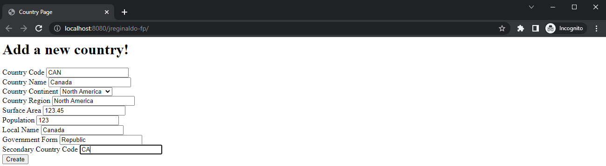

# Josh Reginaldo - ITMD 415
## Final Project Repo
This project helps us learn the basics of an MVC style approach using
JSP/Servlet, and to become familiar with these technologies in order to compare their use to later
frameworks.

This repo will be used for the current "Lab 3" assignment until the end of the semester.  
Commits will be prefixed with the appropriate title (e.g. [Lab 3]) to help distinguish between assignments
## Technology Used:
- OpenJDK 11 ([Temurin 11.0.16.1+1](https://adoptium.net/temurin/releases/?version=11))
- Payara Server Community ([Payara Server 5.2022.3](https://www.payara.fish/downloads/payara-platform-community-edition/))
- MySQL Community Server ([MySQL 8.0.30](https://dev.mysql.com/downloads/mysql/))
## Documentation:
### Questions:
__Difference between the forward and redirect operations:__  
A "forward" is when a servlet requests for another resource, usually another jsp or html page, and transfers control over
to the new resource.  

A "redirect" is when the client directs the user to a whole new URL or application all together.

__How would you be validating user submissions without the Bean Validation API
standard:__  
Without the Bean Validation API, we might have to end up using an incredible amount of try/catch blocks and if/else blocks
to try to check if the input is correct.

__How do you think this approach would scale to a real application with 100's of
entities?__  
This approach probably won't scale well because then each entity would require another set of error checking blocks which
might end up slowing it down. Especially if hundreds of users are trying to send their information all at once.

__Why didn't we need to include any additional dependencies (i.e. Bean Validation,
JDBC) in this project?__  
Since database connectivity wasn't necessarily required for [Lab 3], there was no need for the JDBC dependency to be added.

## Screenshot Validation:
### User passing input validation

### User failing input validation 

